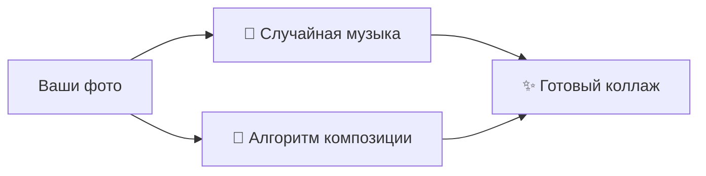

# 🐍 First Steps Python

<div align="center">


**✨ Увлекательное погружение в Python через практические проекты ✨**

</div>

---

## 🎯 О курсе

Этот репозиторий — ваша личная мастерская для изучения Python через создание реальных, интересных и полезных приложений. От простых скриптов до полноценных программ — каждый проект сделает ваше обучение увлекательным и эффективным!

---

## 🚀 Проекты

### 🎵 **1. Музыкальный Коллаж | Music Collage Maker**
> 🎨 *Творчество + технологии = искусство*

**Что создаём?** Умный генератор, который превращает ваши фото в музыкальные коллажи!

<div align="center">



</div>

**🔧 Технологии:** `Pygame` `Pillow` `OS модуль`  
**🎯 Навыки:** Работа с файлами, обработка изображений, случайные числа

---

### 📖 **2. Эмоциональный Дневник | Mood Diary**
> 💭 *Программирование с заботой о себе*

**Что создаём?** Персональный дневник с анализом настроения и защитой данных.

<div align="center">

| Настроение | Эмодзи | Цвет | Особенность |
|------------|--------|------|-------------|
| 😊 Радостное | 😊 | 🟡 | Автоматические цитаты |
| ❤️ Влюбленное | ❤️ | 🔴 | Статистика за неделю |
| 😢 Грустное | 😢 | 🔵 | Поиск по записям |
| 🔐 Защищенное | 🔐 | ⚫ | Шифрование паролем |

</div>

**🔧 Технологии:** `Tkinter/GUI` `Файлы JSON` `Основы безопасности`  
**🎯 Навыки:** Графические интерфейсы, структуры данных, обработка ввода

---

### 🌳 **3. Анализ социальных сетей | Graph Friends Analyzer**
> 👥 *Математика дружбы в коде*

**Что создаём?** Инструмент для анализа связей в социальных графах.

```python
# Пример: Находим общих друзей
def find_common_friends(person1, person2):
    """Волшебство теории графов в действии!"""
    return set(friends[person1]) & set(friends[person2])
```

**🔧 Технологии:** `Теория графов` `Множества` `Словари Python`  
**🎯 Навыки:** Структуры данных, алгоритмы поиска, работа с графами

---

### 🎲 **4. Игровые алгоритмы | Game AI Basics**
> 🤖 *Искусственный интеллект для игр*

**Что создаём?** Простые игровые боты и алгоритмы принятия решений.

<div align="center">

🎮 **Minimax для крестиков-ноликов** → 🤖 **Умный компьютерный соперник**  
🌐 **Парсер веб-страниц** → 🔍 **Автоматический сбор информации**

</div>

**🔧 Технологии:** `Алгоритмы поиска` `Рекурсия` `Веб-парсинг`  
**🎯 Навыки:** Алгоритмическое мышление, работа с сетью, рекурсивные функции

---

### 🛠️ **5. Генератор сайтов | HTML Generator**
> 🌐 *Программируем веб без веба*

**Что создаём?** Python-скрипт, который создаёт HTML-страницы из конфигурации.

```python
# Из этого...
config = {"title": "Мой сайт", "menu": ["Главная", "О нас"]}

# Получаем это! ⬇️
# <html><title>Мой сайт</title>...</html>
```

**🔧 Технологии:** `Шаблонизация` `Работа с текстом` `Автоматизация`  
**🎯 Навыки:** Генерация контента, работа со строками, автоматизация задач

---

## 📊 Что вы освоите

<div align="center">

| Навык | Уровень | Проекты |
|-------|---------|---------|
| **Основы Python** | 🟢 Начинающий | Все проекты |
| **Работа с файлами** | 🟡 Средний | 🎵 📖 |
| **Графические интерфейсы** | 🟡 Средний | 📖 |
| **Алгоритмы** | 🟠 Продвинутый | 🌳 🎲 |
| **Веб-технологии** | 🟡 Средний | 🛠️ |
| **Обработка изображений** | 🟡 Средний | 🎵 |

</div>

---

## 🚀 Быстрый старт

### 1. **Клонируйте репозиторий:**
```bash
git clone https://github.com/Gabryelf/First_Steps_Python.git
cd First_Steps_Python
```

### 2. **Установите зависимости:**
```bash
# Базовые зависимости
pip install pygame pillow

# Для конкретных проектов
pip install -r requirements.txt
```

### 3. **Запускайте проекты:**
```bash
# 🎵 Музыкальный коллаж
python projects/music_collage.py

# 📖 Эмоциональный дневник
python projects/mood_diary.py

# 🌳 Анализ друзей  
python projects/social_analyzer.py
```

---

## 🎯 Для кого этот курс?

<div align="center">

| 👨‍🎓 **Школьники** | 👩‍💻 **Начинающие** | 🎨 **Творческие натуры** | 📚 **Самоучки** |
|-------------------|-------------------|-------------------------|----------------|
| Интересные задачи | Пошаговое обучение | Визуальные проекты | Гибкий график |
| Наглядные примеры | Подробные объяснения | Самовыражение | Практика |

</div>

---


## 💡 Почему это работает?

### **🎯 Принципы обучения:**

1. **От простого к сложному** — начинаем с основ, постепенно добавляем сложность
2. **Вижу → Понимаю → Создаю** — каждый проект имеет четкую цель
3. **Практика > Теория** — минимум теории, максимум кода
4. **Ошибки = Опыт** — учимся на собственных ошибках

### **✨ Уникальность подхода:**

- 🔄 **Интерактивность** — программы реагируют на ваши действия
- 🎨 **Визуальная обратная связь** — сразу видите результат
- 🎮 **Игровые элементы** — обучение через игру
- 💼 **Практическая польза** — создаете реальные приложения

---

## 🌟 Что дальше?

После освоения этих проектов вы будете готовы к:

1. **Собственным идеям** — адаптируйте код под свои нужды
2. **Более сложным темам** — базы данных, веб-фреймворки, машинное обучение
3. **Командным проектам** — участвуйте в opensource или создавайте с друзьями
4. **Портфолио** — добавьте проекты в свое портфолио разработчика

---

## 🤝 Как внести вклад?

Нашли ошибку? Есть идея для нового проекта?

1. **Создайте Issue** — опишите проблему или предложение
2. **Сделайте Fork** — создайте свою копию репозитория
3. **Отправьте Pull Request** — предложите свои улучшения

---

<div align="center">

## 🚀 Начните прямо сейчас!

**Выберите проект, который вас вдохновляет, и погрузитесь в мир Python!**

💫 *Каждая строчка кода — шаг к мастерству* 💫

[](https://github.com/your-username/First_Steps_Python)
[](https://github.com/your-username/First_Steps_Python/fork)

</div>

---

## 📞 Контакты и поддержка

- 📧 **Email**: gabryelf@yandex.ru
- 💬 **Telegram**: @Gabryelf

*Курс постоянно обновляется и улучшается!*

---

<div align="right">

*С любовью к коду и обучению,*  
*Команда First Steps Python*  
*© 2026*

</div>
